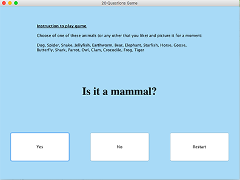
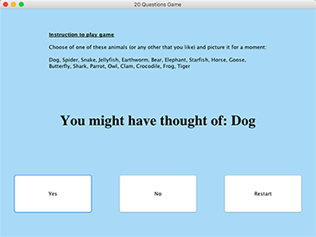

# 20 Questions Game

This program is a simple version of the 20Q (20 Questions) game invented by Robin Burgener in 1988. The game asks the player to think of a subject, asks twenty Yes/No questions and then guesses the identity of the subject. The game utilizes neural-network-based artificial intelligence to produce the answer and is able to improve over time by learning from its interactions with the player. 

In this simplified version of the game, the program gives player a small list of options, asks Yes/No questions and then presents a possible guess based on player's answer. 

 

## Tree structure represents a simple neural network 
Each question is a node in the tree, and the tree of questions represents a network of possible paths the program can take based on the answers of the player. QuestionTree defines a tree of questions (with methods to set and get the root). TreeNode defines a node in the tree (with methods to get and set data, get and set left and right children, and check whether a node has leaves or not). 

## xml file stores a potential arrangment of the tree

## File Description

* GuessingGameController and Unrestri
