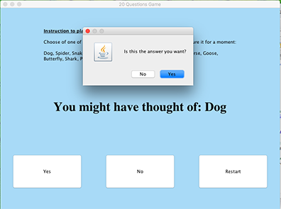
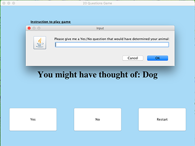

# 20 Questions Game

This program is a simple version of the 20Q (20 Questions) game invented by Robin Burgener in 1988. The game asks the player to think of a subject, asks twenty Yes/No questions and then guesses the identity of the subject. The game utilizes neural-network-based artificial intelligence to produce the answer and is able to improve over time by learning from its interactions with the player. 

In this simple version of the game, the program gives player a small list of options to start with, asks Yes/No questions and then presents a possible guess based on the information from player. There are two modes: restricted and unrestricted. 
 In the restricted mode, the program's guess is final. 

 

In the unrestricted mode, after the guess, the program asks player whether this is the correct answer. If the player chooses No, the program then proceeds to ask for the correct answer, a question that can detect the correct answer, and whether the answer to that question is Yes or No. All of this information is saved into the game for the next round. The program "learns" more from the player as more games are played. 

 

## Decision tree represents a simple neural network 
Each question is a node in a basic decision tree. The tree of questions represents a network of possible paths the program can traverse based on the answers of the player. [QuestionTree.java](https://github.com/vantrinh7/20Questions/blob/master/src/stackutils/QuestionTree.java) defines a tree of questions (with methods to set and get the tree root). [TreeNode.java](https://github.com/vantrinh7/20Questions/blob/master/src/stackutils/TreeNode.java) defines a node in the tree (with methods to get and set the node's data, get and set the node's children, and check whether it has leaves or not). 

## XML file stores a potential arrangment of the tree
This program uses an XML file as a starting point for a possible arrangement of the tree. [Tree.xml](https://github.com/vantrinh7/20Questions/blob/master/tree.xml) is an example structure of questions and answers presented in the game. The program then calls [QuestionFileReader.java](https://github.com/vantrinh7/20Questions/blob/master/src/stackutils/QuestionFileReader.java), which uses JAXP - a XML reading API provided by Java - to translate XML file into a format Java programs can use.

## Unrestricted game modifies the question tree
In the restricted mode, the program uses the information from the existing question tree, but does not modify the tree. In the unrestricted mode, the progam uses the player's input to create new nodes of question and answer, and save them for the next round after Restart button is pressed. [GuessingGameController.java](https://github.com/vantrinh7/20Questions/blob/master/src/stackutils/GuessingGameController.java) and [UnrestrictedGuessingGameController.java](https://github.com/vantrinh7/20Questions/blob/master/src/stackutils/UnrestrictedGuessingGameController.java) are classes that create the view, handle button click events and define each mode. [GuessingGameGUIApplication.java](https://github.com/vantrinh7/20Questions/blob/master/src/stackutils/GuessingGameGUIApplication.java) and [UnrestrictedGuessingGameGUIApplication.java](https://github.com/vantrinh7/20Questions/blob/master/src/stackutils/UnrestrictedGuessingGameGUIApplication.java) have the main method and create the JFrame that holds the view. 
